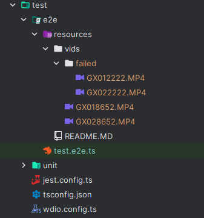

# ReelSteady Joiner Test Resources

This directory contains resources for testing the ReelSteady Joiner.

Configure this directory with this structure (depending on the number of video files, the test code will need to be adjusted.):

Place corrupted .mp4 files in the `failed` directory to test the Joiner's ability to detect them.
(0 bytes file with .mp4 extension should work)
